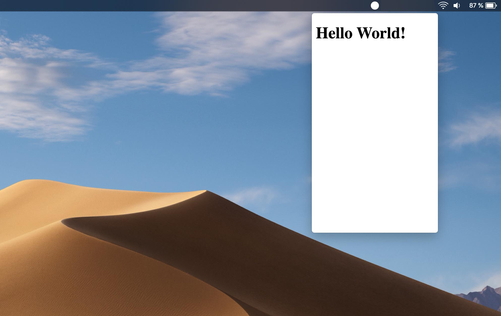

#Electron Tray App Template
The quickest way to create an electron app located in the menu bar. This also works on windows and changes its position according to the position of the taskbar.

Made with **Electron 6.0.0**

## Features
- Works on MacOS and Windows (not tested on Linux)
- Every Taskbar Position supported
- Great UX

## Setup
First install all dependencies with npm. Don't worry the only dependency used is Electron (and the dependencies it uses).

``` bash
npm install
```

``` bash
npm start
```

## Showcase


